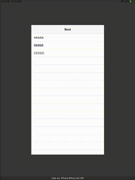
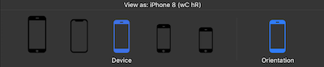

# iPhoneSimulator for Playground

[](https://opensource.org/licenses/MIT)



**iPhoneSimulator for Playground** allows you to display the view controller with simulating the screen size of the iPhone devices.

You can also found the *Swift Playground* version from [here](https://github.com/watanabetoshinori/iPhoneSimulator-for-SwiftPlaygrounds).

- [Features](#Features)
- [Getting Started](#getting-started)
    - [Requirements](#requirements)
    - [Installation](#installation)
- [Usage](#usage)
    - [Run iPhone Simulator](#run-iphone-simulator)
    - [Change Device or Orientation](#change-device-or-orientation)
- [Author](#author)
- [License](#license)

## Features
- [x] Simulate the iPhone screen sizes. (8 Plus / X / 8 / SE / 4S)
- [x] Simulate the orientation. (Landscape / Portrait)

## Getting Started

### Requirements

* Xcode 10.0+
* Swift 4.2+

### Installation

**[Cocoa Pods](https://cocoapods.org)**

```sh
pod 'iPhoneSimulator', :git => 'git@github.com:watanabetoshinori/iPhoneSimulator-for-Playground.git'
```

## Usage

### Initialization

Start by importing the package in the Playground file you want to use it.

```swift
import iPhoneSimulator
```

### Run iPhone Simulator

```swift
let viewController = ViewController()

PlaygroundPage.current.liveView = iPhoneSimulator.liveView(with: viewController)
```

### Change Device or Orientation

Tap the bottom of LiveView to display the toolbar.



* Tap Device image to change simulation device.
* Tap Orientaion to change view orientation.

## Author

Watanabe Toshinori – toshinori_watanabe@tiny.blue

## License

This project is licensed under the MIT License. See the [LICENSE](LICENSE) file for details.
